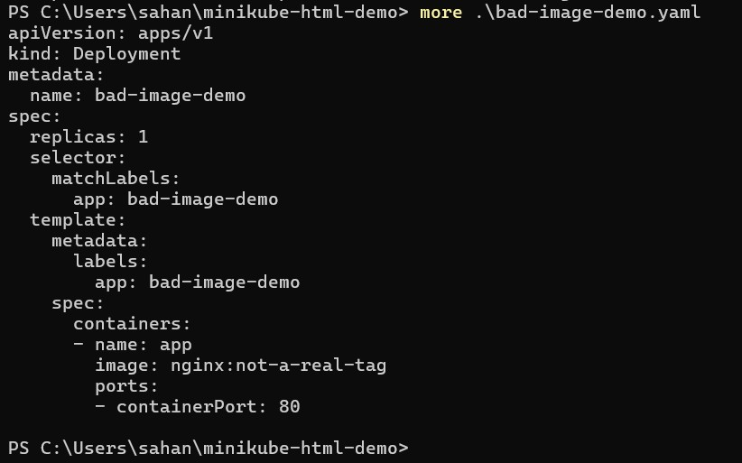
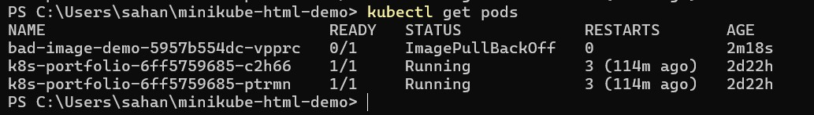
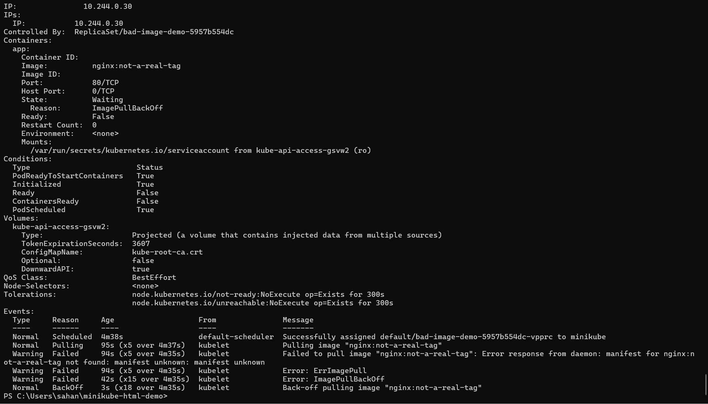
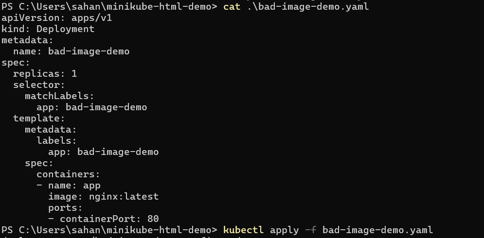
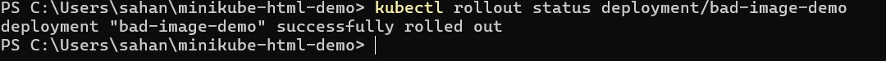
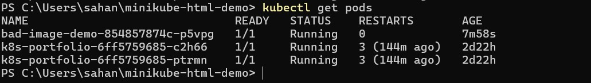

# ImagePullBackOff — Diagnostic Runbook

**Scope:** Kubernetes pod stuck in ImagePullBackOff or ErrImagePull  
**Environment:** GPU cloud / HPC (Crusoe CKE, bare metal K8s)  
**Author:** Sahana  
**Last updated:** 2026-03-18

---

## What is ImagePullBackOff

A pod enters ImagePullBackOff when Kubernetes cannot pull the container image from the registry. The pod never starts — no application runs, no logs are generated. Kubernetes retries with an exponential backoff timer identical to CrashLoopBackOff: 10s, 20s, 40s, 80s, up to 5 minutes between attempts.

Two status values indicate this failure:

- `ErrImagePull` — the first failed pull attempt
- `ImagePullBackOff` — subsequent attempts after backoff kicks in

At Crusoe this means a customer's training job, inference server, or batch workload never initializes. The customer sees a pod that never reaches Running. Unlike CrashLoopBackOff there are no application logs — the container never started.

---

## Before you touch anything

1. Do not delete the pod until you have read the Events section from describe
2. Confirm whether this is one pod or many — multiple pods failing simultaneously suggests a registry outage or credential issue, not a single image tag problem
3. Ask the customer if the image tag is correct before assuming it is a platform issue
4. Check whether this worked previously — a previously working image that now fails points to a registry problem, not a typo

---

## Diagnostic steps

### Step 1 — Establish scope

```bash
kubectl get pods
```

Read three fields:

| Field | What it tells you |
|---|---|
| STATUS | ErrImagePull on first attempt, ImagePullBackOff on retry |
| RESTARTS | Will stay at 0 — container never started, so no restarts |
| AGE | How long Kubernetes has been trying to pull |

Expected output:
```
NAME               READY   STATUS             RESTARTS   AGE
training-job       0/1     ImagePullBackOff   0          4m
```

RESTARTS staying at 0 is the key difference from CrashLoopBackOff. The container never ran — there is nothing to restart yet.

---

### Step 2 — Read the Events

```bash
kubectl describe pod <pod-name>
```

Skip to the Events section at the bottom. This is where the evidence lives — unlike CrashLoopBackOff there is no exit code or Last State to read because the container never started.

Common event messages and what they mean:

| Event message | Root cause | Action |
|---|---|---|
| `Failed to pull image: not found` | Image tag does not exist | Customer typo or wrong tag — fix the image reference |
| `Failed to pull image: unauthorized` | Registry credentials missing or expired | Check imagePullSecret, escalate if platform credentials |
| `Failed to pull image: connection refused` | Node cannot reach the registry | Network issue on the node, escalate to SRE |
| `Back-off pulling image` | Retry backoff in progress | Confirms the loop — read the earlier Failed event for root cause |

Save the describe output before making any changes:

```bash
kubectl describe pod <pod-name> > <pod-name>-describe.txt
```

---

### Step 3 — Check the image reference

Look at the pod spec to see exactly what image was requested:

```bash
kubectl get pod <pod-name> -o yaml | grep image
```

Output will show:
```
image: nginx:not-a-real-tag
```

Verify whether that tag exists. For public images, check Docker Hub. For private images, ask the customer to confirm the tag exists in their registry.

---

### Step 4 — Check image pull secrets if unauthorized

If the event shows `unauthorized`, the node cannot authenticate to the registry:

```bash
kubectl get secrets
kubectl describe secret <secret-name>
```

Check whether the imagePullSecret is referenced in the pod spec:

```bash
kubectl get pod <pod-name> -o yaml | grep imagePullSecret
```

If the secret exists but is not referenced — customer config error, fix the pod spec. If the secret is missing entirely — escalate to SRE to provision registry credentials.

---

### Step 5 — Check node connectivity if connection refused

If the event shows `connection refused` or a network timeout:

```bash
kubectl get pod <pod-name> -o wide
kubectl describe node <node-name>
```

Look at node Conditions for NetworkUnavailable or NotReady. A node that cannot reach the registry affects every pod scheduled to it — check whether other pods on the same node have the same symptom.

---

## Fix and verify

### Fix 1 — Wrong image tag (most common)

Update the image reference in the deployment YAML:

```yaml
image: nginx:latest
```

Apply the fix:

```bash
kubectl apply -f deployment.yaml
kubectl rollout status deployment/<name>
```

Watch the rollout complete, then confirm the pod is running:

```bash
kubectl get pods -w
```

### Fix 2 — Missing imagePullSecret

Add the secret reference to the pod spec:

```yaml
spec:
  imagePullSecrets:
  - name: registry-credentials
```

Then reapply and verify.

---

## Screenshots

Visual evidence from the lab reproduction below.

### 01 — YAML with invalid image
Deployment spec showing the incorrect image tag before the fix.



What to notice: the image tag `nginx:not-a-real-tag` is visibly wrong. In production the error is often more subtle — a private registry path with a typo, or a tag that was deleted after a new release.

---

### 02 — Pod status ImagePullBackOff
`kubectl get pods` showing ErrImagePull progressing to ImagePullBackOff.



What to notice: RESTARTS stays at 0 throughout. This distinguishes ImagePullBackOff from CrashLoopBackOff where restarts climb. The container never started so there is nothing to restart.

---

### 03 — Describe pod events
`kubectl describe pod` showing the Failed to pull image event with the specific error message.



What to notice: the Events section is your entire evidence base here. There is no exit code, no Last State, no application logs — the container never ran. The event message tells you exactly what failed and why.

---

### 04 — Fixed YAML applied
Updated deployment spec with correct image tag being applied.



What to notice: fix the cause first, then apply. Never delete and redeploy with the same broken image — the loop starts again immediately.

---

### 05 — Rollout success
`kubectl rollout status` confirming the deployment rolled out successfully.



What to notice: rollout status is more reliable than just watching pod status — it confirms the full deployment lifecycle completed, not just that one pod reached Running briefly.

---

### 06 — Pod running
`kubectl get pods` showing STATUS: Running and RESTARTS: 0.



What to notice: RESTARTS stays at 0. Combined with Running status this is your verification that the fix worked and the image pulled successfully.

---

## Escalation map

| Evidence | Escalation | What to include |
|---|---|---|
| Tag not found, public image | Customer | Correct tag, link to registry |
| Tag not found, private image | Customer | Ask them to verify tag exists in their registry |
| Unauthorized, missing secret | Customer or SRE | Pod spec missing imagePullSecret reference |
| Unauthorized, secret exists | SRE | Secret may be expired or misconfigured |
| Connection refused to registry | SRE | Node name, network connectivity evidence |
| Multiple pods on multiple nodes failing | SRE + registry team | Registry outage, platform-wide impact |

---

## Key difference from CrashLoopBackOff

| | CrashLoopBackOff | ImagePullBackOff |
|---|---|---|
| Container started | Yes | No |
| Logs available | Yes — use --previous | No — container never ran |
| RESTARTS climbing | Yes | No — stays at 0 |
| Exit code | Yes | No |
| Evidence location | Last State + logs | Events section only |
| Root cause layer | App, config, memory | Registry, credentials, network |

---

## Customer communication

**On detection:**
```
Your pod [name] is in ImagePullBackOff — Kubernetes 
cannot pull the container image. Investigating now, 
will update in 10 minutes.
```

**On root cause identified — customer error:**
```
The image tag [tag] does not appear to exist in the 
registry. Can you confirm the correct tag? Once 
confirmed I can update the deployment.
```

**On root cause identified — platform issue:**
```
The node is unable to reach the registry. This is 
a platform-level issue. I am escalating to the 
infrastructure team now and will keep you updated.
```

---

## RCA template

```
Incident: ImagePullBackOff on pod [name]
Customer: [name]
Severity: [P1/P2/P3]

Timeline:
  [time]  Customer reported pod not starting
  [time]  ImagePullBackOff confirmed, RESTARTS: 0
  [time]  Root cause identified: [event message]
  [time]  Fix applied: [what changed]
  [time]  Pod running, rollout confirmed

Root cause:
  [One sentence — specific event message and what caused it]

Fix:
  [Exactly what was changed — image tag, secret, network]

Prevention:
  [Image tag validation in CI/CD, secret rotation alerts]
```

---

## Lab reproduction

```bash
# Start cluster
minikube start

# Create deployment with invalid image
kubectl apply -f bad-image-demo.yaml

# Observe failure
kubectl get pods -w

# Diagnose
kubectl describe pod <pod-name>
kubectl get pod <pod-name> -o yaml | grep image

# Save evidence
kubectl describe pod <pod-name> > pod-describe.txt

# Fix — update image tag in YAML then
kubectl apply -f bad-image-demo.yaml
kubectl rollout status deployment/bad-image-demo

# Verify
kubectl get pods -w
```

---

## Related scenarios

- [CrashLoopBackOff](../crashloopbackoff/crashloopbackoff-runbook.md) — container starts but crashes repeatedly
- [OOMKilled](../oomkilled/oomkilled-runbook.md) — container killed by kernel for exceeding memory limit
- [Pending pod](../pendingpod/pending-pod-runbook.md) — pod never scheduled, insufficient resources
